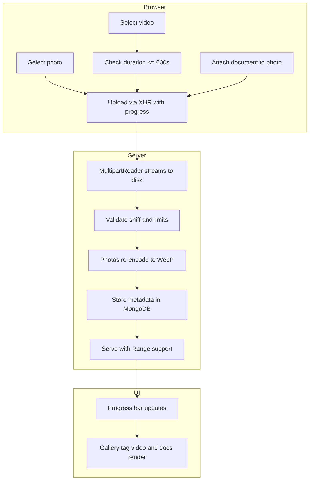

# eoProject — Media & UX Upgrade Plan

Target product: `eduardoos.com` (backend `eduardoos.com/backend`, frontend `eduardoos.com/frontend`).

## Decisions

1. **WebP conversion**: performed **on the server in Go** using a cgo-free WebP encoder (`github.com/gen2brain/webp`, libwebp transpiled to pure Go via wasm2go). Uploaded JPEG/PNG/WebP photos are decoded, optionally downscaled, and re-encoded to a smaller lossy `.webp` before storage. Original bytes are not retained.
2. **Video**: accept up to 10 minutes of 4K video, stored as-is with a **streaming** upload and **no transcoding**. Serving uses HTTP Range for seeking.
3. **Tags**: a single short label rendered **above each image** (caption-style), editable by the owner, read-only on invite pages.
4. **Documents**: multiple documents may be attached to a photo; generic file types with a size cap.

## Backend changes

### Data model (`eoproject_models.go`)

- Add `Tag string` field to `eoprojectPhoto` (bson/json `tag`, omitempty).
- New `eoprojectVideo` and `eoprojectPhotoDocument` types.
- New collections: `eoproject_videos`, `eoproject_photo_documents`.
- New limits/constants: `eoprojectMaxTagLen`, `eoprojectMaxVideoSeconds`, `defaultEoprojectMaxVideoBytes`, `defaultEoprojectMaxDocBytes`.
- `eoprojectStageBundle` now carries `videos`; photos carry computed `documents`.

### Store (`eoproject_store.go`)

- `eoprojectStore` interface extended with `UpdatePhoto`, video CRUD, and document CRUD + cascade deletes.
- Memory and Mongo implementations added; `eoprojectFS` extended with `videosDir`, `docsDir`, `writeStream`, `putVideoStream`, `putDocStream`, `openVideo`, `openDoc`, `deleteVideo`, `deleteDoc`.

### HTTP (`eoproject_http.go`)

- Streaming upload helper `eoprojectOpenFilePart` (MultipartReader + MaxBytesReader + io.Copy).
- New endpoints for video list/upload/serve/delete (plus invite serve), photo tag PATCH, and per-photo document list/upload/download/delete (plus invite download).
- Dashboard/invite payloads now include videos and per-photo documents.
- Cascade deletes extended for videos and documents.

### Photo → WebP conversion (`eoproject_http.go` + `go.mod`)

- Add dependency `github.com/gen2brain/webp` (cgo-free, required because CI builds with `CGO_ENABLED=0`).
- In `eoprojectUploadPhoto`: keep JPEG/PNG/WebP input validation, decode to `image.Image` (stdlib), optionally downscale to a max edge, encode with `webp.Encode` at a configurable quality (e.g. 82), and store the result with `.webp` extension and `image/webp` content type. If encoding fails, fail the upload rather than silently storing the original.

### Config (`config.go`, `app.go`)

- `EoprojectMaxVideoBytes` and `EoprojectMaxDocumentBytes`, loaded from env with safe defaults in `loadConfig` and `newAppWithStore`.

## Frontend changes

### Client libs

- `lib/api.ts`: add `uploadFileWithProgress(path, file, { fields, onProgress })` using `XMLHttpRequest` `upload.onprogress` with CSRF header.
- `lib/eoproject.ts`: progress-aware `uploadEoprojectPhoto`, `uploadEoprojectIfc`; new video and document functions; `updateEoprojectPhotoTag`.

### UI

- Reusable progress bar (`.eoproject__progress`) for photo/IFC/video uploads.
- Video upload with duration check (reject > 600s), `<video controls preload="metadata">` playback in project and invite pages.
- Tag rendered above each thumbnail with inline edit, tag input on upload, shown in lightbox and invite view.
- Document attach/list/download/delete per photo with badge count.
- UX polish: wire `updateEoprojectProject`/`updateEoprojectStage`, stage reordering, targeted refresh, styled confirm modals, copy-share-link, accessibility focus management.

## Deploy / Nginx (`docs/nginx/eduardoos.com.conf`)

- Raise `client_max_body_size` for `/api/` to the video cap (e.g. 5g) and increase `proxy_read_timeout`/`proxy_send_timeout` for long uploads. Keep `proxy_buffering off`.

## Testing

- Port `_wip_eoproject/eoproject_test.go` into `eduardoos.com/backend` and extend with video/tag/document tests.
- Frontend Vitest units for the progress helper.

## Risks / notes

- `gen2brain/webp` avoids native build deps (works under `CGO_ENABLED=0`) but is slower than libvips; acceptable at the current photo size cap (12 MiB).
- HEIC/HEIF input remains unsupported (Go stdlib cannot decode it).
- Large video files imply high disk usage; consider lifecycle cleanup and quotas later.
- Files larger than a single Nginx request may need chunked/resumable upload in the future.

